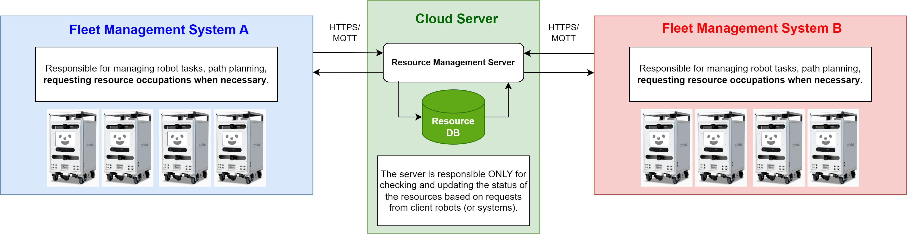

# resource_management_server

Python package for launching a Flask-based server for running the "Resource Management Server" endpoint compliant with [RFA (Robot Friendly Asset Promotion Association)](https://robot-friendly.org/) Standards.

>[!Note]
Not all functionalities are implemented yet. This is a work in progress.
(e.g. `max_timeout` and `default_timeout` are not handled as is expected in the RFA Standards.)

## About Resource Management Server

Resource Management Server is a concept standardized by RFA, as defined in the [RFA規格(ロボット群管理インタフェイス定義 RFA B 0004 : 2024)](https://robot-friendly.org/publication/rfa%e8%a6%8f%e6%a0%bc%e3%83%ad%e3%83%9c%e3%83%83%e3%83%88%e7%be%a4%e7%ae%a1%e7%90%86%e3%82%a4%e3%83%b3%e3%82%bf%e3%83%95%e3%82%a7%e3%82%a4%e3%82%b9%e5%ae%9a%e7%be%a9-rfa-b-0004-2024/) (English version to be published in the future).

The server is responsible for managing the occupation status of the "resources (places that only one or few robots can pass at a time such as narrow aisles)" inside buildings and is expected to serve as a bridge for sharing blockage information between separate robot fleets managed by separate systems (either based on Open-RMF or not).

Each robot trying to pass through the resource is expected to "register" for the resource by accessing the server before entering it. Information about the resource is expected to be shared beforehand with all fleet system managers by the Resource Management Server operator.

Such servers and agreements to use it are necessary because the robots working inside a certain building does not always belong to the same fleet management system.

For further information, please follow the link above.

## Prepare resource configuration

See [sample_resource_config.yaml](config/sample_resource_config.yaml) and create your own file containing a list of resource configuration you want to manage.

## Install

```bash
cd ~/workspace
git clone https://github.com/sbgisen/resource_management_server.git
cd resource_management_server
pip install .
```

## Quick Test

### Launch Server

Launch the Resource Management Server as follows.

```bash
cd ~/workspace/resource_management_server/resource_management_server
export RESOURCE_YAML_PATH=/path/to/resource_config.yaml
flask run --host=0.0.0.0 --port=5000
```

### Get All Resource Information

(Not defined in RFA Standards, but for debug purposes.)

Example Request:

```bash
curl -X GET http://127.0.0.1:5000/api/all_data
```

Example Response:

```json
[{"bldg_id":"Takeshiba","default_timeout":90000,"expiration_time":0,"locked_by":"","locked_time":0,"max_timeout":90000,"resource_id":"27F_R01","resource_type":1},{"bldg_id":"Takeshiba","default_timeout":180000,"expiration_time":0,"locked_by":"","locked_time":0,"max_timeout":180000,"resource_id":"27F_R02","resource_type":1}]
```

### Request Resource Registration

Example Request:

```bash
curl -X POST http://127.0.0.1:5000/api/registration -H "Content-Type: application/json" -d '{
  "api": "Registration",
  "robot_id": "cuboid01",
  "bldg_id" : "Takeshiba",
  "resource_id": "27F_R01",
  "timeout" : 0,
  "request_id": "12345",
  "timestamp": 1725962117942
}'
```

Make sure that the unit of time stamp is milliseconds (same goes for other APIs).
Registrations will be automatically deleted after the timeout specified for the target resource (these timeouts should be defined in the config file).

Example Response:

```json
{"api":"RegistrationResult","expiration_time":1725962207942,"max_expiration_time":1725962207942,"request_id":"12345","result":1,"timestamp":1725962123157}
```

### Request Resource Release

Example Request:

```bash
curl -X POST http://127.0.0.1:5000/api/release -H "Content-Type: application/json" -d '{
  "api": "Release",
  "robot_id": "cuboid01",
  "bldg_id" : "Takeshiba",
  "resource_id": "27F_R01",
  "timeout" : 0,
  "request_id": "12345",
  "timestamp": 1725948482218
}'
```

Example Response:

```json
{"api":"ReleaseResult","request_id":"12345","resource_id":"27F_R01","result":1,"timestamp":1725962697012}
```

### Request Resource Status

Example Request:

```bash
curl -X POST http://127.0.0.1:5000/api/request_resource_status -H "Content-Type: application/json" -d '{
  "api": "RequestResourceStatus",
  "bldg_id" : "Takeshiba",
  "resource_id": "27F_R01",
  "request_id": "12345",
  "timestamp": 1725948482218
}'
```

Example Response:

```json
{"api":"ResourceStatus","expiration_time":0,"max_expiration_time":0,"request_id":"12345","resource_id":"27F_R01","resource_state":0,"result":1,"robot_id":"","timestamp":1725962223906}
```

### Send Robot Status

Example Request:

```bash
curl -X POST http://127.0.0.1:5000/api/robot_status -H "Content-Type: application/json" -d '{
  "api": "RobotStatus",
  "robot_id": "cuboid01",
  "bldg_id" : "Takeshiba",
  "resource_id": "27F_R01",
  "state": 0,
  "state_detail": 0,
  "request_id": "12345",
  "timestamp": 1725948482218
}'
```

Example Response:

```json
{"api":"RobotStatusResult","request_id":"12345","result":1,"timestamp":1725962547709}
```

>[!Note]
Functions are not fully implemented for this API and data from the request will not be treated unless it's a CANCEL request (registration will be remove in this case).
